# Design reference — Flowline Product UI Design (v1.0)

Source: `Flowline — Product UI Design.pptx` (16 slides, 16:9). Slides are native shapes (no raster images);
`slides/slide-NN.png` were rendered with LibreOffice (Debian bookworm, fonts-inter + fonts-jetbrains-mono) at 110 dpi.
Slide titles, section numbers and the browser-frame chrome are **presentation framing, not app UI**.
The deck is a reference for screens and interactions — not approval of pricing, integration counts or model names (see DESIGN_DECISIONS.md D4–D7).

## Extracted tokens

| Token | Value | Use |
|---|---|---|
| bg/app | `#09090B` | canvas base |
| surface | `#111113` | sidebar, header |
| card | `#18181B` | nodes, panels |
| elevated | `#27272A` | popovers, menus |
| text/high | `#FAFAFA` | titles, values |
| text/medium | `#A1A1AA` | labels, metadata |
| text/muted | `#52525B` | placeholders |
| accent | `#7C6CFF` | primary actions |
| success | `#34D399` | run completed |
| warning | `#FBBF24` | partial, expired |
| error | `#F87171` | failed, destructive |
| info/running | `#38BDF8` | in progress |
| radius | sm 4 · md 6 · lg 8 · xl 12 | |
| borders | 1px always (2px only focus rings) | |
| focus ring | double: 2px bg + 2px accent | |
| popover shadow | 4px offset / 16px blur | |
| type (Inter) | xl 20–26/600/lh28 · lg 16/600/24 · base 13/400/20 · sm 12/400/18 · xs 11/500 ls .4 | |
| data font | JetBrains Mono | IDs, timestamps, payloads |
| motion | press 80 · hover 150 · tabs/badges 200 · drawer 250 expo-out · max 300ms | |
| easing | expo-out `cubic-bezier(0.16,1,0.3,1)` · symmetric `cubic-bezier(0.4,0,0.2,1)` | |
| layout | sidebar 240 · rail 48 · drawer 360 · run dock 240 · canvas min 840 · snap 12px | |

## Slides

### Slide 1 — Cover  
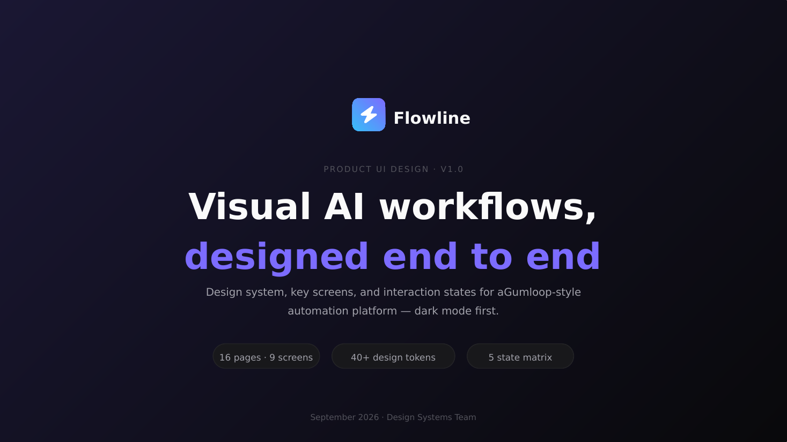  
Text: Flowline · PRODUCT UI DESIGN · V1.0 · Visual AI workflows, · designed end to end · Design system, key screens, and interaction states for a · Gumloop-style automation platform — dark mode first. · 16 pages · 9 screens · 40+ design tokens · 5 state matrix · September 2026 · Design Systems Team

### Slide 2 — Product map / journey  
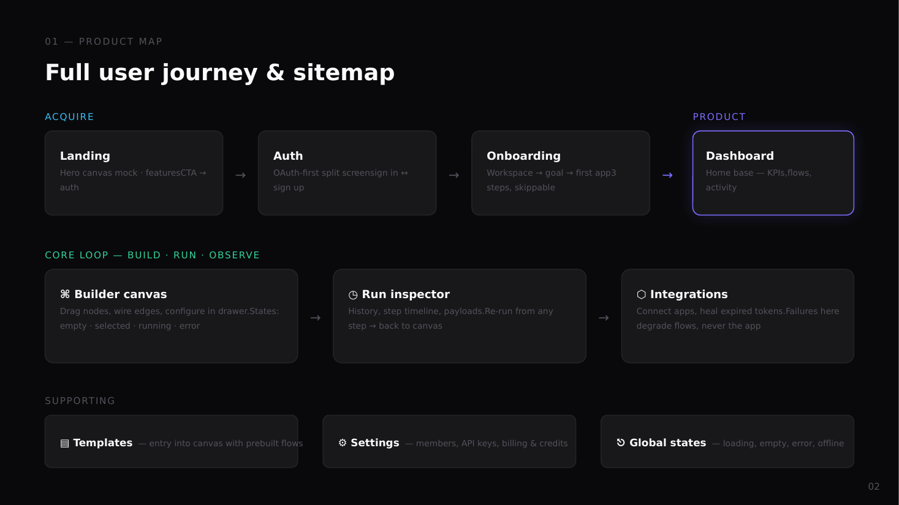  
Text: 01 — PRODUCT MAP · Full user journey & sitemap · ACQUIRE · Landing · Hero canvas mock · features · CTA → auth · → · Auth · OAuth-first split screen · sign in ↔ sign up · → · Onboarding · Workspace → goal → first app · 3 steps, skippable · → · PRODUCT · Dashboard · Home base — KPIs, · flows, activity · CORE LOOP — BUILD · RUN · OBSERVE · ⌘ Builder canvas · Drag nodes, wire edges, configure in drawer. · States: empty · selected · running · error · → · ◷ Run inspector · History, step timeline, payloads. · Re-run from any step → back to canvas · → · ⬡ Integrations · Connect apps, heal expired tokens. · Failures here degrade flows, never the app · SUPPORTING · ▤ Templates · — entry into canvas with prebuilt flows · ⚙ Settings · — members, API keys, billing & credits · ⎋ Global states · — loading, empty, error, offline

### Slide 3 — Design tokens — colour  
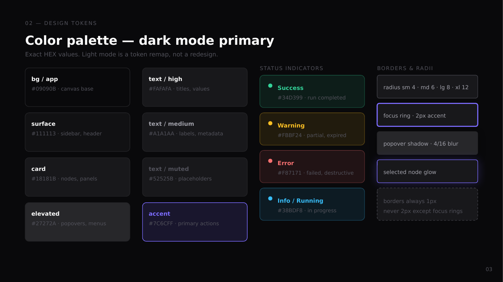  
Text: 02 — DESIGN TOKENS · Color palette — dark mode primary · Exact HEX values. Light mode is a token remap, not a redesign. · bg / app · #09090B · canvas base · surface · #111113 · sidebar, header · card · #18181B · nodes, panels · elevated · #27272A · popovers, menus · text / high · #FAFAFA · titles, values · text / medium · #A1A1AA · labels, metadata · text / muted · #52525B · placeholders · accent · #7C6CFF · primary actions · STATUS INDICATORS · Success · #34D399 · run completed · Warning · #FBBF24 · partial, expired · Error · #F87171 · failed, destructive · Info / Running · #38BDF8 · in progress · BORDERS & RADII · radius sm 4 · md 6 · lg 8 · xl 12 · focus ring · 2px accent · popover shadow · 4/16 blur · selected node glow · borders always 1px · never 2px except focus rings

### Slide 4 — Type & components  
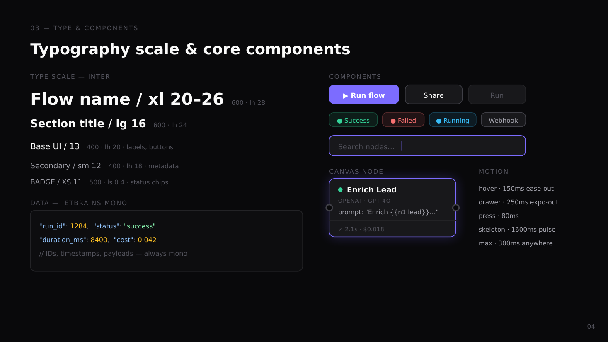  
Text: 03 — TYPE & COMPONENTS · Typography scale & core components · TYPE SCALE — INTER · Flow name / xl 20–26 · 600 · lh 28 · Section title / lg 16 · 600 · lh 24 · Base UI / 13 · 400 · lh 20 · labels, buttons · Secondary / sm 12 · 400 · lh 18 · metadata · BADGE / XS 11 · 500 · ls 0.4 · status chips · DATA — JETBRAINS MONO · "run_id" · : · 1284 · , · "status" · : · "success" · "duration_ms" · : · 8400 · , · "cost" · : · 0.042 · // IDs, timestamps, payloads — always mono · COMPONENTS · ▶ Run flow · Share · Run · ● Success · ● Failed · ● Running · Webhook · Search nodes… · CANVAS NODE · Enrich Lead · OPENAI · GPT-4O · prompt: "Enrich {{n1.lead}}…" · ✓ 2.1s · $0.018 · MOTION · hover · 150ms ease-out · drawer · 250ms expo-out · press · 80ms · skeleton · 1600ms pulse · max · 300ms anywhere

### Slide 5 — Screen · Landing  
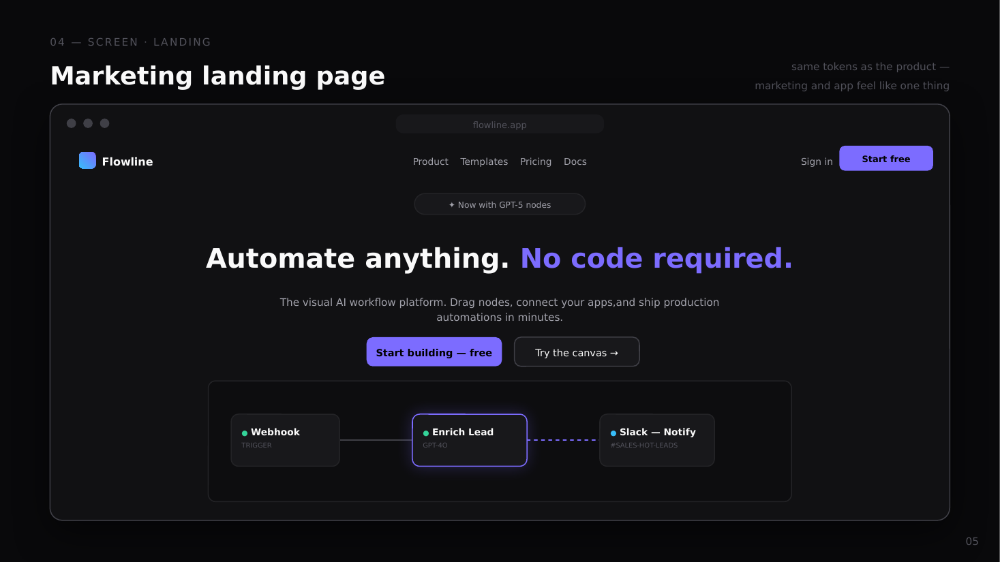  
Text: 04 — SCREEN · LANDING · Marketing landing page · same tokens as the product — · marketing and app feel like one thing · flowline.app · Flowline · Product    Templates    Pricing    Docs · Sign in · Start free · ✦ Now with GPT-5 nodes · Automate anything. · No code required. · The visual AI workflow platform. Drag nodes, connect your apps, · and ship production automations in minutes. · Start building — free · Try the canvas → · ● · Webhook · TRIGGER · ● · Enrich Lead · GPT-4O · ● · Slack — Notify · #SALES-HOT-LEADS

### Slide 6 — Screens · Auth & onboarding  
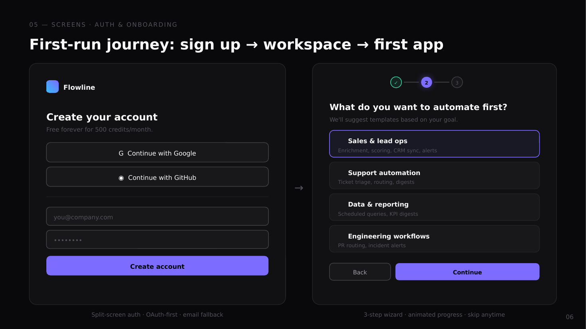  
Text: 05 — SCREENS · AUTH & ONBOARDING · First-run journey: sign up → workspace → first app · Flowline · Create your account · Free forever for 500 credits/month. · G  Continue with Google · ◉  Continue with GitHub · you@company.com · •••••••• · Create account · Split-screen auth · OAuth-first · email fallback · → · ✓ · 2 · 3 · What do you want to automate first? · We'll suggest templates based on your goal. · 📈 · Sales & lead ops · Enrichment, scoring, CRM sync, alerts · 🎧 · Support automation · Ticket triage, routing, digests · 📊 · Data & reporting · Scheduled queries, KPI digests · 🛠 · Engineering workflows · PR routing, incident alerts · Back · Continue · 3-step wizard · animated progress · skip anytime

### Slide 7 — Screen · Dashboard  
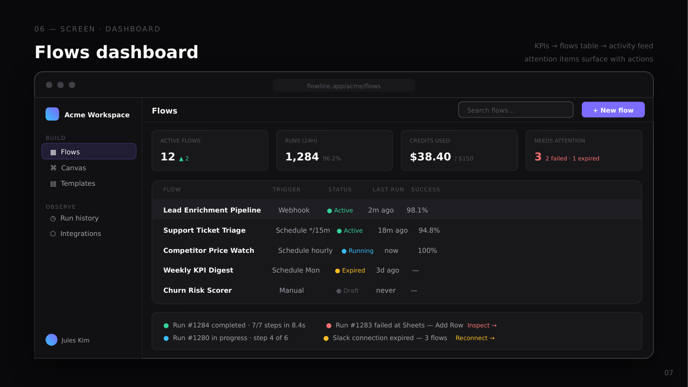  
Text: 06 — SCREEN · DASHBOARD · Flows dashboard · KPIs → flows table → activity feed · attention items surface with actions · flowline.app/acme/flows · Acme Workspace · BUILD · ▦  Flows · ⌘  Canvas · ▤  Templates · OBSERVE · ◷  Run history · ⬡  Integrations · Jules Kim · Flows · Search flows… · + New flow · ACTIVE FLOWS · ▲ 2 · RUNS (24H) · 1,284 · 96.2% · CREDITS USED · $38.40 · / $150 · NEEDS ATTENTION · 3 · 2 failed · 1 expired · FLOW                                        TRIGGER            STATUS         LAST RUN   SUCCESS · Lead Enrichment Pipeline · Webhook · ● Active · 2m ago      98.1% · Support Ticket Triage · Schedule */15m · ● Active · 18m ago     94.8% · Competitor Price Watch · Schedule hourly · ● Running · now         100% · Weekly KPI Digest · Schedule Mon · ● Expired · 3d ago      — · Churn Risk Scorer · Manual · ● Draft · never       — · ● · Run #1284 completed · 7/7 steps in 8.4s · ● · Run #1283 failed at Sheets — Add Row · Inspect → · ● · Run #1280 in progress · step 4 of 6 · ● · Slack connection expired — 3 flows · Reconnect →

### Slide 8 — Screen · Builder canvas  
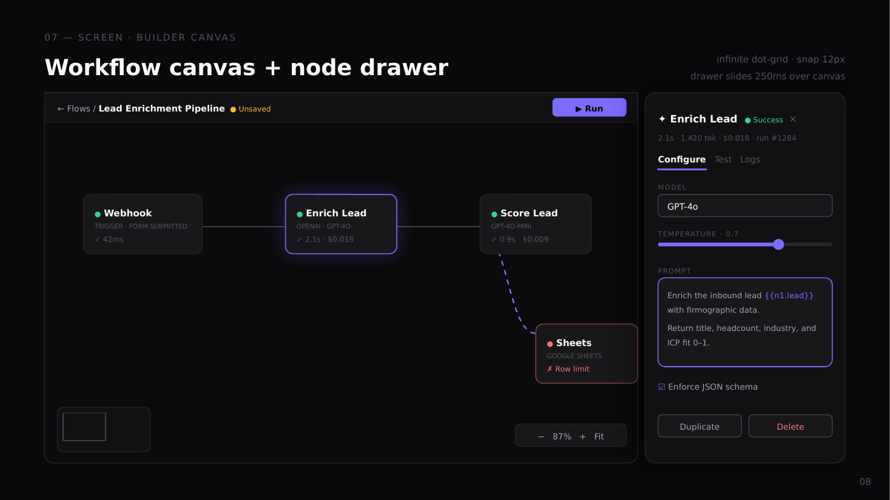  
Text: 07 — SCREEN · BUILDER CANVAS · Workflow canvas + node drawer · infinite dot-grid · snap 12px · drawer slides 250ms over canvas · ← Flows / · Lead Enrichment Pipeline · ● Unsaved · ▶ Run · ● · Webhook · TRIGGER · FORM.SUBMITTED · ✓ 42ms · ● · Enrich Lead · OPENAI · GPT-4O · ✓ 2.1s · $0.018 · ● · Score Lead · GPT-4O-MINI · ✓ 0.9s · $0.009 · ● · Sheets · GOOGLE SHEETS · ✗ Row limit · −   87%   +   Fit · ✦ Enrich Lead · ● Success · ✕ · 2.1s · 1,420 tok · $0.018 · run #1284 · Configure · Test   Logs · MODEL · GPT-4o · TEMPERATURE · 0.7 · PROMPT · Enrich the inbound lead · {{n1.lead}} · with firmographic data. · Return title, headcount, industry, and ICP fit 0–1. · ☑ · Enforce JSON schema · Duplicate · Delete

### Slide 9 — Screen · Run inspector  
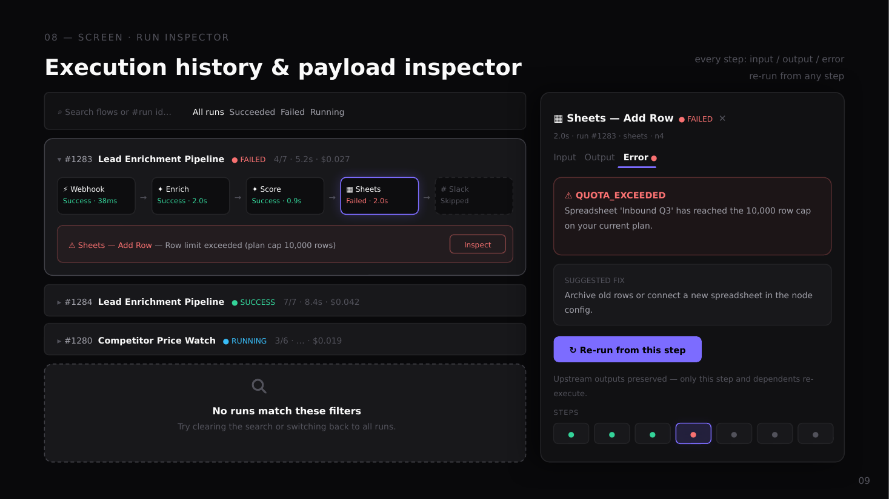  
Text: 08 — SCREEN · RUN INSPECTOR · Execution history & payload inspector · every step: input / output / error · re-run from any step · ⌕ Search flows or #run id… · All runs · Succeeded  Failed  Running · ▾ · #1283 · Lead Enrichment Pipeline · ● FAILED · 4/7 · 5.2s · $0.027 · ⚡ Webhook · Success · 38ms · → · ✦ Enrich · Success · 2.0s · → · ✦ Score · Success · 0.9s · → · ▦ Sheets · Failed · 2.0s · → · # Slack · Skipped · ⚠ Sheets — Add Row · — Row limit exceeded (plan cap 10,000 rows) · Inspect · ▸ · #1284 · Lead Enrichment Pipeline · ● SUCCESS · 7/7 · 8.4s · $0.042 · ▸ · #1280 · Competitor Price Watch · ● RUNNING · 3/6 · … · $0.019 · No runs match these filters · Try clearing the search or switching back to all runs. · ▦ Sheets — Add Row · ● FAILED · ✕ · 2.0s · run #1283 · sheets · n4 · Input   Output · Error · ● · ⚠ QUOTA_EXCEEDED · Spreadsheet 'Inbound Q3' has reached the 10,000 row cap on your current plan. · SUGGESTED FIX · Archive old rows or connect a new spreadsheet in the node config. · ↻ Re-run from this step · Upstream outputs preserved — only this step and dependents re-execute. · STEPS · ● · ● · ● · ● · ● · ● · ●

### Slide 10 — Screen · Integrations  
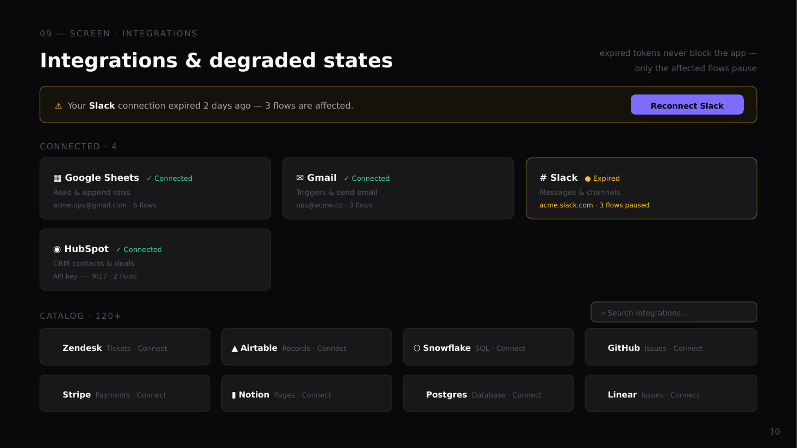  
Text: 09 — SCREEN · INTEGRATIONS · Integrations & degraded states · expired tokens never block the app — · only the affected flows pause · ⚠ · Your · Slack · connection expired 2 days ago — 3 flows are affected. · Reconnect Slack · CONNECTED · 4 · ▦ Google Sheets · ✓ Connected · Read & append rows · acme.ops@gmail.com · 6 flows · ✉ Gmail · ✓ Connected · Triggers & send email · ops@acme.co · 3 flows · # Slack · ● Expired · Messages & channels · acme.slack.com · 3 flows paused · ◉ HubSpot · ✓ Connected · CRM contacts & deals · API key ····· 9f27 · 2 flows · CATALOG · 120+ · ⌕ Search integrations… · 🔍 · Zendesk · Tickets · Connect · ▲ · Airtable · Records · Connect · ⬡ · Snowflake · SQL · Connect · 🐙 · GitHub · Issues · Connect · 💳 · Stripe · Payments · Connect · ▮ · Notion · Pages · Connect · 🗄 · Postgres · Database · Connect · 📊 · Linear · Issues · Connect

### Slide 11 — Screen · Templates  
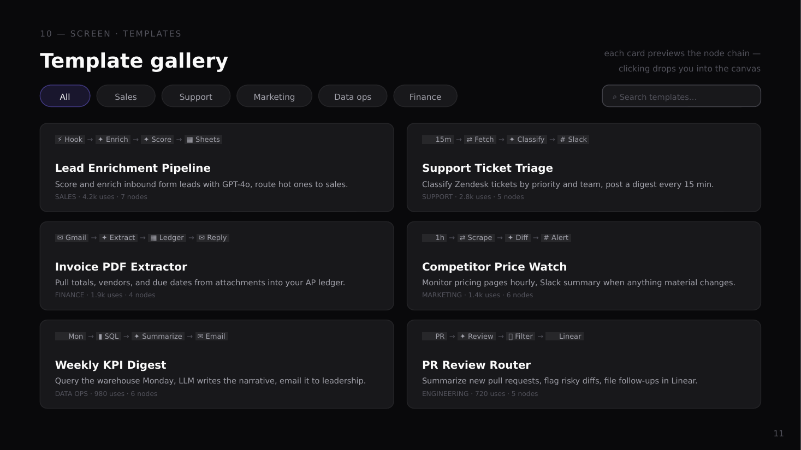  
Text: 10 — SCREEN · TEMPLATES · Template gallery · each card previews the node chain — · clicking drops you into the canvas · All · Sales · Support · Marketing · Data ops · Finance · ⌕ Search templates… · ⚡ Hook · → · ✦ Enrich · → · ✦ Score · → · ▦ Sheets · Lead Enrichment Pipeline · Score and enrich inbound form leads with GPT-4o, route hot ones to sales. · SALES · 4.2k uses · 7 nodes · 🕐 15m · → · ⇄ Fetch · → · ✦ Classify · → · # Slack · Support Ticket Triage · Classify Zendesk tickets by priority and team, post a digest every 15 min. · SUPPORT · 2.8k uses · 5 nodes · ✉ Gmail · → · ✦ Extract · → · ▦ Ledger · → · ✉ Reply · Invoice PDF Extractor · Pull totals, vendors, and due dates from attachments into your AP ledger. · FINANCE · 1.9k uses · 4 nodes · 🕐 1h · → · ⇄ Scrape · → · ✦ Diff · → · # Alert · Competitor Price Watch · Monitor pricing pages hourly, Slack summary when anything material changes. · MARKETING · 1.4k uses · 6 nodes · 🕐 Mon · → · ▮ SQL · → · ✦ Summarize · → · ✉ Email · Weekly KPI Digest · Query the warehouse Monday, LLM writes the narrative, email it to leadership. · DATA OPS · 980 uses · 6 nodes · 🐙 PR · → · ✦ Review · → · ⑂ Filter · → · 📊 Linear · PR Review Router · Summarize new pull requests, flag risky diffs, file follow-ups in Linear. · ENGINEERING · 720 uses · 5 nodes

### Slide 12 — Screen · Settings  
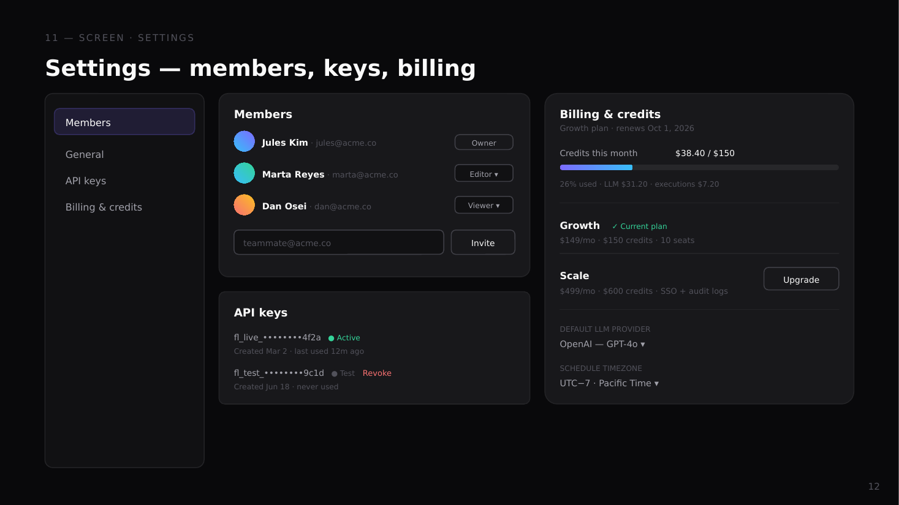  
Text: 11 — SCREEN · SETTINGS · Settings — members, keys, billing · Members · General · API keys · Billing & credits · Members · Jules Kim · · jules@acme.co · Owner · Marta Reyes · · marta@acme.co · Editor ▾ · Dan Osei · · dan@acme.co · Viewer ▾ · teammate@acme.co · Invite · API keys · fl_live_••••••••4f2a · ● Active · Created Mar 2 · last used 12m ago · fl_test_••••••••9c1d · ● Test · Revoke · Created Jun 18 · never used · Billing & credits · Growth plan · renews Oct 1, 2026 · Credits this month · $38.40 / $150 · 26% used · LLM $31.20 · executions $7.20 · Growth · ✓ Current plan · $149/mo · $150 credits · 10 seats · Scale · $499/mo · $600 credits · SSO + audit logs · Upgrade · DEFAULT LLM PROVIDER · OpenAI — GPT-4o ▾ · SCHEDULE TIMEZONE · UTC−7 · Pacific Time ▾

### Slide 13 — State matrix  
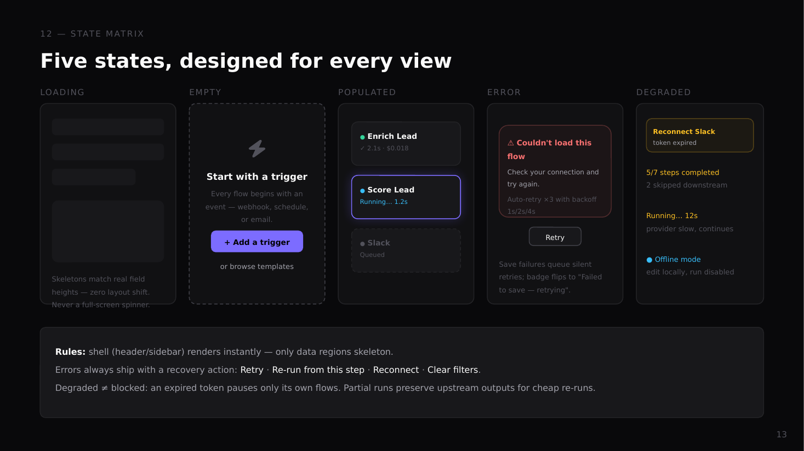  
Text: 12 — STATE MATRIX · Five states, designed for every view · LOADING · EMPTY · POPULATED · ERROR · DEGRADED · Skeletons match real field heights — zero layout shift. Never a full-screen spinner. · Start with a trigger · Every flow begins with an event — webhook, schedule, or email. · + Add a trigger · or browse templates · ● · Enrich Lead · ✓ 2.1s · $0.018 · ● · Score Lead · Running… 1.2s · ● · Slack · Queued · ⚠ Couldn't load this flow · Check your connection and try again. · Auto-retry ×3 with backoff 1s/2s/4s · Retry · Save failures queue silent retries; badge flips to "Failed to save — retrying". · Reconnect Slack · token expired · 5/7 steps completed · 2 skipped downstream · Running… 12s · provider slow, continues · ● Offline mode · edit locally, run disabled · Rules: · shell (header/sidebar) renders instantly — only data regions skeleton. · Errors always ship with a recovery action: · Retry · · · Re-run from this step · · · Reconnect · · · Clear filters · . · Degraded ≠ blocked: an expired token pauses only its own flows. Partial runs preserve upstream outputs for cheap re-runs.

### Slide 14 — Responsive  
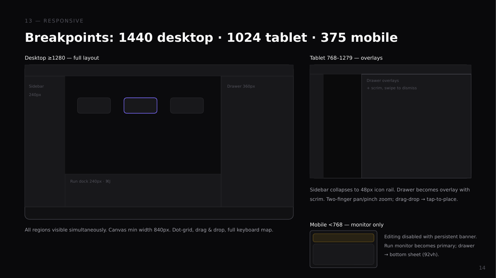  
Text: 13 — RESPONSIVE · Breakpoints: 1440 desktop · 1024 tablet · 375 mobile · Desktop ≥1280 — full layout · Sidebar · 240px · Drawer 360px · Run dock 240px · ⌘J · All regions visible simultaneously. Canvas min width 840px. Dot-grid, drag & drop, full keyboard map. · Tablet 768–1279 — overlays · Drawer overlays
+ scrim, swipe to dismiss · Sidebar collapses to 48px icon rail. Drawer becomes overlay with scrim. Two-finger pan/pinch zoom; drag-drop → tap-to-place. · Mobile <768 — monitor only · Editing disabled with persistent banner. Run monitor becomes primary; drawer → bottom sheet (92vh).

### Slide 15 — Motion & interaction  
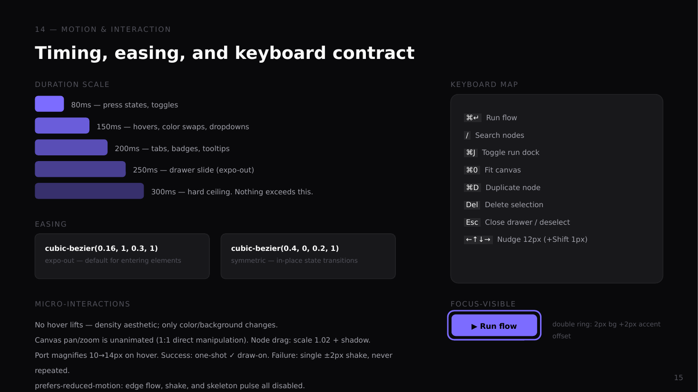  
Text: 14 — MOTION & INTERACTION · Timing, easing, and keyboard contract · DURATION SCALE · 80ms — press states, toggles · 150ms — hovers, color swaps, dropdowns · 200ms — tabs, badges, tooltips · 250ms — drawer slide (expo-out) · 300ms — hard ceiling. Nothing exceeds this. · EASING · cubic-bezier(0.16, 1, 0.3, 1) · expo-out — default for entering elements · cubic-bezier(0.4, 0, 0.2, 1) · symmetric — in-place state transitions · MICRO-INTERACTIONS · No hover lifts — density aesthetic; only color/background changes. · Canvas pan/zoom is unanimated (1:1 direct manipulation). Node drag: scale 1.02 + shadow. · Port magnifies 10→14px on hover. Success: one-shot ✓ draw-on. Failure: single ±2px shake, never repeated. · prefers-reduced-motion: edge flow, shake, and skeleton pulse all disabled. · KEYBOARD MAP · ⌘↵ · Run flow · / · Search nodes · ⌘J · Toggle run dock · ⌘0 · Fit canvas · ⌘D · Duplicate node · Del · Delete selection · Esc · Close drawer / deselect · ←↑↓→ · Nudge 12px (+Shift 1px) · FOCUS-VISIBLE · ▶ Run flow · double ring: 2px bg + · 2px accent offset

### Slide 16 — Design coverage  
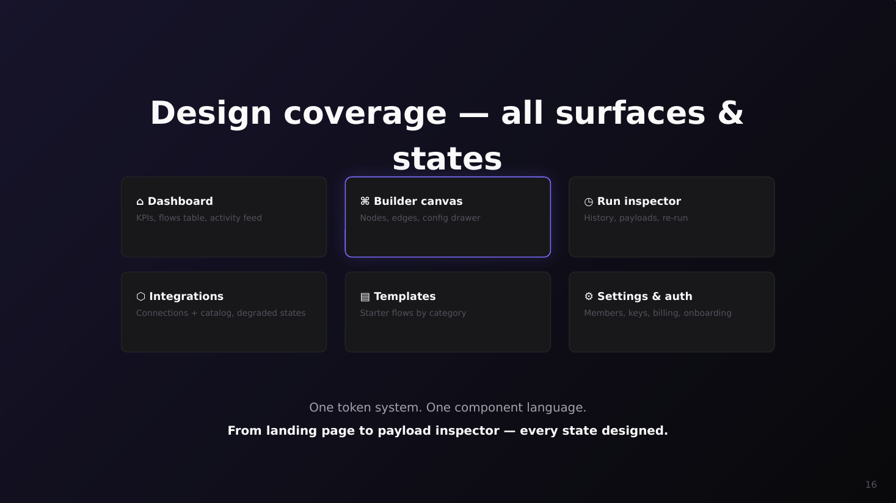  
Text: Design coverage — all surfaces & states · ⌂ Dashboard · KPIs, flows table, activity feed · ⌘ Builder canvas · Nodes, edges, config drawer · ◷ Run inspector · History, payloads, re-run · ⬡ Integrations · Connections + catalog, degraded states · ▤ Templates · Starter flows by category · ⚙ Settings & auth · Members, keys, billing, onboarding · One token system. One component language. · From landing page to payload inspector — every state designed.
