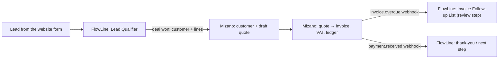

# FlowLine — vision and goals

_Updated 2026-10-10 in the backlog restructure. Goals are GitHub milestones; each has a 'Goal demo' issue with manual test steps on the daily test link. Board: https://github.com/users/AbdelrhmanAh7/projects/21._

## Vision

FlowLine is the Arabic-first workflow automation platform for small teams in Egypt and the Gulf: anyone can build a flow (trigger → steps → human approval) in minutes, run it reliably and see every run. The pilot (invites on 16 Oct 2026, week-1 review on 23 Oct) proves that 5, then 10, real workflow builders can sign up, publish and run webhook and scheduled flows with approvals, safely and in Arabic. The next phase makes FlowLine the 'work that moves' half of one company stack with Mizano, the 'books' half: a won deal becomes a Mizano quote, an overdue Mizano invoice starts a follow-up flow — always with a human approval before anything leaves the company.

## Pilot goals

| Goal (milestone) | Due | Acceptance criteria | Demo |
|---|---|---|---|
| [FL G1 · Green main, zero high alerts](https://github.com/AbdelrhmanAh7/FlowLine_Web/milestone/7) | 2026-10-12 | Pilot blocker gate. Done when: (1) main CI is green on 3 consecutive pushes; (2) 0 open high/critical Dependabot alerts; (3) every CodeQL alert is fixed or dismissed with a written reason (#111-#114); (4) the MFA regression follow-up (#80) is merged. Demo: the Goal demo issue in this milestone. | #150 |
| [FL G2 · First stable tag, 25/25 pilot features green](https://github.com/AbdelrhmanAh7/FlowLine_Web/milestone/8) | 2026-10-14 | Done when: a stable-YYYY-MM-DD tag exists with 25/25 pilot features green in the hub e2e run; the e2e reds on main (#117, #119, #103) are closed; test sign-ups can auto-verify on staging only (#124); no known flaky pilot test (#35). Demo: the Goal demo issue. | #151 |
| [FL G3 · Pilot launch: 5 users invited](https://github.com/AbdelrhmanAh7/FlowLine_Web/milestone/9) | 2026-10-16 | Done when: 5 beta codes are issued and >= 3 invited users have signed in; the restore/rollback runbook draft (#68) and field-run docs (#106) are merged; the pilot video (#137) and landing demo (#96) are published. Owner-only steps stay in #30. Demo: the Goal demo issue. | #152 |
| [FL G4 · Week-1 review: go/no-go for 10 users](https://github.com/AbdelrhmanAh7/FlowLine_Web/milestone/10) | 2026-10-23 | Done when: every pilot success criterion in the hub pilot plan is measured from staging data (sign-ups <= 3 min, publish rate, run success >= 95 %, 0 duplicate runs, 0 cross-workspace exposure, uptime >= 99 %), written up, and a go/no-go decision for 10 users is recorded. Demo: the Goal demo issue. | #153 |

## Next phase

| Goal (milestone) | Due | Acceptance criteria | Demo |
|---|---|---|---|
| [FL G5 · Mizano connector v1](https://github.com/AbdelrhmanAh7/FlowLine_Web/milestone/11) | 2026-11-20 | Next phase. Done when: a FlowLine user can connect a Mizano workspace with a scoped API key, run the 'Deal won -> Mizano quote' template end to end (customer + draft quote appear in Mizano, money sent as decimal strings, a human approval step before anything leaves the company) and list overdue Mizano invoices into the Invoice Follow-up List flow. Depends on Mizano 'MZ G5 · FlowLine integration API'. Story: planned, not yet written (tracked by epic #144). | #154 |
| [FL G6 · Post-pilot hardening: concurrency and quality](https://github.com/AbdelrhmanAh7/FlowLine_Web/milestone/12) | 2026-11-06 | Next phase. Done when: every known lock-order deadlock (#41, #42, #45, #47 split #108/#109) has a failing-then-passing regression test using the shared concurrent-tx helper (#90), lock-order docs exist (#120-#122), and the remaining out-of-pilot fixes in this milestone are merged or closed. | #155 |

## FlowLine ↔ Mizano integration (planned)

Status: vision, not built. Full story and data contracts: planned (`docs/video/integration-story.md` is not written yet; tracked by epic #144).

- This repo's side: epic #144 in goal **FL G5 · Mizano connector v1** (due 2026-11-20).
- Other side: the G5 epic in [AbdelrhmanAh7/Mizano](https://github.com/AbdelrhmanAh7/Mizano/milestones).
- Rules: money as decimal strings; no autonomous payments or tax submission; a human approval step before anything leaves the company; Arabic names kept as entered.

## How the hub uses this

- The dispatcher ranks ready issues by pilot scope, then the milestone due date, then `priority:p0..p3` — so earlier goals are worked first.
- Goal demo, epic and tracker issues carry `ai-skip`; they are never queued for the AI engineers.
